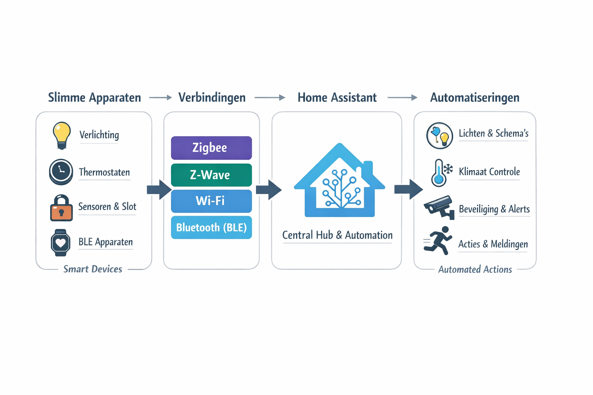

# 🏠 Homelab Dashboard & Automation Stack

<!--  -->

## Inhoudsopgave
## Inhoudsopgave
- [Overzicht](#overzicht)
- [Functies](#supporting-services-in-het-script)
  - [Home Assistant](#home-assistant)
  - [Beszel](#beszel)
  - [Homepage](#homepage)
  - [Uptime-Kuma](#uptime-kuma)
  - [Node-RED](#node-red)
  - [Grafana & InfluxDB](#grafana--influxdb)
  - [Portainer](#portainer)
  - [Dozzle](#dozzle)
  - [IT-Tools](#it-tools)
  - [Mosquitto (MQTT)](#mosquitto-mqtt)
  - [MariaDB](#mariadb)
  - [DuckDNS](#duckdns)
  - [Gotify](#gotify)
- [Notifications](#notifications)
- [Hardware Detectie](#hardware-detectie)
- [Netwerk Hardening](#netwerk-hardening)
- [Backup & Data Management](#backup--data-management)
- [Opmerkingen](#opmerkingen)
- [Additional Services](#additional-services)
- [Aanbevolen GitHub Repositories](#aanbevolen-github-repositories)
- [Services & Poorten Overzicht](#services--poorten-overzicht)
- [Roadmap](#roadmap)
- [FlowChart / Mermaid Diagram](#flowchart)

---

## Overzicht
Deze homelab-stack biedt een complete plug-and-play omgeving voor smart home automatisering, monitoring en serverbeheer. Het draait op **Debian 13 Minimal** en gebruikt Docker containers voor maximale isolatie, stabiliteit en eenvoud.  

> **Een complete, productie-gerichte homelab stack voor Home Assistant, monitoring, automatisering en containerbeheer — volledig Docker-based en direct inzetbaar.**

### Waarom deze stack?

- 🐳 Volledig Docker-based
- 🔒 Network hardening standaard ingeschakeld
- 📊 Volledige monitoring stack inbegrepen
- 🔁 Automatische backups
- 🔌 Hardware auto-detectie

Alle Docker-installaties gebruiken de **officiële Docker repositories** voor Debian 13, zodat je altijd de nieuwste stabiele versie krijgt.

> **Technische documentatie:** Alle installatie- en configuratiestappen zijn gedetailleerd beschreven in [`install.sh`](./install.sh).

## Problemen melden

Ondervind je een probleem? Open dan een *issue* op GitHub.

Voeg hierbij altijd het bestand `ha-install.log` toe.  
Dit logbestand helpt bij het analyseren en oplossen van het probleem.

**Zo voeg je het logbestand toe:**
1. Open een nieuw issue.
2. Sleep het bestand `ha-install.log` in het tekstveld, of voeg het toe via de uploadfunctie.
3. Beschrijf zo duidelijk mogelijk wat er misgaat en wanneer het probleem optreedt.

> ⚠️ **Issues zonder logbestand kunnen mogelijk niet in behandeling worden genomen.**

---

## Home Assistant Apparatuur
Voor een volledig overzicht van alle apparaten die je kunt integreren met Home Assistant, zie [apparatuur.md](./apparatuur.md).

> Tip: bevat veelvoorkomende apparaten, vergeten apparaten en Bluetooth (BLE) apparaten met integratie tips.

[Home Assistant Automations & Dashboards Tips](automation_dashboards_tips.md)

---

## Supporting Services in het Script 

### Home Assistant
- Centrale smart home hub.
- Ondersteunt Zigbee, Z-Wave, BLE, RF, IR en P1 Smart Meters.
- Verzamelt data via MQTT en slaat deze op in **MariaDB**.
- Dashboard configuratie via YAML-bestanden.

### Beszel
- **Hub**: dashboard met real-time systeemstatus en container monitoring.
- **Agent**: verzamelt metrics van de host machine.
- Lichtgewicht alternatief voor Netdata.
- Eenvoudig te koppelen met Home Assistant en andere services.

### Homepage
- Centrale startpagina voor alle webbased apps in het homelab.
- Statische links en statuswidgets voor:
  - Home Assistant
  - Portainer
  - Beszel
  - Uptime-Kuma
  - IT-Tools

### Uptime-Kuma
- Monitoren van uptime van services en externe websites.
- Waarschuwingen bij downtime.

### Node-RED
- Web-based flow editor en visual programming tool voor Home Automation en IoT.
- Werkt samen met Home Assistant via MQTT, API’s en websockets.

### Grafana & InfluxDB
- Historische metrics en visualisatie van systeem- en containerstatistieken.
- Grafana dashboards voor CPU, RAM, Disk, Docker containers en meer.

### Portainer
- Docker management interface.
- Containerbeheer, volume-inspectie en netwerkbeheer.

### Dozzle
- Real-time logging van Docker containers.
- Handig voor debugging en monitoring.

### IT-Tools
- Webinterface met diagnostische tools voor netwerk en systeem.
- Toont hardware-informatie, logs en netwerkstatus.

### Mosquitto (MQTT)
- Berichtenbus voor smart home devices en automatisering.
- Communicatie tussen Home Assistant, Zigbee2MQTT, Z-Wave JS, BLE2MQTT en andere IoT-devices.

### MariaDB
- MySQL-database voor Home Assistant.
- Betere prestaties dan SQLite.
- Eenvoudige data migratie via `configuration.yaml`.

### DuckDNS
- Dynamische DNS voor externe toegang.
- Integreert met Home Assistant en andere webbased apps.

### Gotify
- Zelf-gehoste push notificatieservice.
- Wordt gebruikt voor realtime alerts van Home Assistant of andere services.
- REST API integratie, eenvoudig te configureren met secrets.

## Notifications

- **Telegram**: primaire notificaties
- **Email**: backup notificaties
- **Gotify**: extra push notificaties

---

## Hardware Detectie
- Automatische detectie van USB-devices: Zigbee, Z-Wave, BLE, RF, IR, P1 Smart Meters
- Detectie van Bluetooth-adapters.
- Containers starten alleen als het device aanwezig is.
- Logging van aangesloten hardware en mogelijke fouten.

---

## Netwerk Hardening
- Firewall configuratie via **UFW**:
  - Open poorten voor Home Assistant, Portainer, Beszel, Uptime-Kuma en IT-Tools.
  - Poort 22 open voor SSH.
  - Alle andere inkomende verbindingen standaard geblokkeerd.
- Fail2Ban voor extra SSH-bescherming.
- Root login via SSH uitgeschakeld.

---

## Backup & Data Management
- Automatische dagelijkse backups naar `backups/`.
- Backup van configuratiebestanden en kritieke data voor alle containers.

---

## Opmerkingen
- Minimum systeemvereisten: 15 GB vrije schijfruimte, 4 GB RAM.
- Hardware zoals Zigbee, Z-Wave of BLE wordt automatisch gedetecteerd.
- Alle logs en foutmeldingen worden weggeschreven naar `$HOME/ha-install.log`.

---

## Additional Services
- **Portainer** → Docker container management  
- **Dozzle** → Real-time container logs  
- **IT-Tools** → Diagnostics & utilities  
- **DuckDNS** → External access / dynamic DNS
- **Gotify** → Push notificaties van Home Assistant of andere services
---

## Aanbevolen GitHub Repositories
- [Zigbee2MQTT](https://github.com/Koenkk/zigbee2mqtt) – Zigbee integratie  
- [Z-Wave JS](https://github.com/zwave-js/zwavejs2mqtt) – Z-Wave controller en MQTT bridge  
- [ESPHome](https://github.com/esphome/esphome) – ESP32/ESP8266 automatisering  
- [Home Assistant Community Add-ons](https://github.com/home-assistant/addons) – Officiële add-ons  
- [Uptime-Kuma](https://github.com/louislam/uptime-kuma) – Self-hosted monitoring  
- [Portainer CE](https://github.com/portainer/portainer) – Docker beheer  
- [Beszel](https://github.com/henrygd/beszel) – Real-time monitoring dashboard  
- [Homepage](https://github.com/gethomepage/homepage) – Startpagina/dashboard  
- [IT-Tools](https://github.com/corentinth/it-tools) – Diagnostics & monitoring  
- [Node-RED](https://github.com/node-red/node-red) – Flow-based automation en integratie tool
- [Dozzle](https://github.com/amir20/dozzle) – Real-time Docker log viewer via webinterface
- [InfluxDB](https://github.com/influxdata/influxdb) – Time-series database voor metrics en monitoring  
- [Grafana](https://github.com/grafana/grafana) – Visualisatie dashboards voor metrics en logs  
- [BLE2MQTT](https://github.com/devbis/ble2mqtt) – Bluetooth Low Energy devices koppelen aan MQTT  
- [MQTT-IR / Beszel Hub](https://github.com/beszel/beszel) – MQTT en IR integratie / hub functionaliteit  
- [P1 Monitor](https://github.com/P1Monitor/p1monitor) – Energieverbruik monitoring via slimme meter (P1 poort)  
- [CrowdSec](https://github.com/crowdsecurity/crowdsec) – Collaborative security en intrusion prevention
- [Watchtower](https://github.com/containrrr/watchtower) – Automatische Docker container updates  
- [DuckDNS](https://github.com/linuxserver/docker-duckdns) – Dynamic DNS voor thuisservers en homelabs

---

## Services & Poorten Overzicht

| Poort   | Service                 | Beschrijving                                          |
|--------|------------------------|------------------------------------------------------|
| 8120   | Mosquitto (MQTT)       | MQTT broker voor device-communicatie                 |
| 8121   | Zigbee2MQTT            | Zigbee integratie via MQTT                            |
| 8122   | ESPHome                | ESP32/ESP8266 programmering en device beheer        |
| 8123   | Home Assistant         | Centrale smart home hub                               |
| 8124   | Portainer (HTTP)       | Docker management interface                           |
| 8125   | Portainer (HTTPS)      | Docker management interface                           |
| 8126   | Dozzle                 | Real-time container logs                              |
| 8127   | InfluxDB               | Metrics database                                      |
| 8128   | Grafana                | Dashboard visualisatie van metrics                    |
| 8129   | Z-Wave JS              | Z-Wave integratie via MQTT                             |
| 8130*  | BLE2MQTT               | BLE devices via MQTT                                  |
| 8131*  | MQTT-IR / Beszel Hub   | IR devices via MQTT / monitoring dashboard           |
| 8132*  | P1 Monitor / Uptime-Kuma | Slimme meter uitlezing / uptime monitoring         |
| 8133   | Homepage               | Startpagina/dashboard voor web-apps                  |
| 8134   | CrowdSec               | Security & threat monitoring                          |
| 8135   | IT-Tools               | Diagnostics & monitoring tools                        |
| 8136   | Node-RED               | Flow editor voor automatiseringen via MQTT/API       |
| 8137   | Gotify                 |Push notificaties via REST API                |
| --     | Watchtower             | Automatische container updates                        |
| --     | Beszel Agent           | Metric agent van de host                               |
| --     | DuckDNS                | Dynamische DNS update service                          |

\* Poorten kunnen verschillen afhankelijk van device-configuratie.  

---

## Roadmap
Geplande uitbreidingen en verbeteringen voor de homelab stack:
- [ ] Modulair installatiescript (per service modules)
- [ ] Ansible deployment ondersteuning
- [ ] Kubernetes / Helm stack variant
- [ ] Multi-node en schaalbare homelab architectuur
- [ ] High Availability (HA) clustering
> De roadmap laat toekomstige uitbreidingen zien voor meer modulariteit, schaalbaarheid en high-availability opties.

---

## FlowChart 
(klik voor uitvergroting afbeelding)
> Deze flowchart laat de relaties tussen services en poorten in de homelab stack zien.

[![](https://mermaid.ink/img/pako:eNp9VG1P2zAQ_iuWpX1ay0ooTYkmpL4w6AaI0SIk1n1wEze1mtid4_DOf9-d3by0FPIl9_Lc-ey7515oqCJOAzpP1EO4YNqQyXAqCXxfvpAzlXLSy41KmRFKkoHS3DnPen-m1LmzTGSGSTOlf53vzrsA552IZ5x7F78nk-8zfexUcjPuV7hbds8R2USB_BxbnFPquP75iU0D0EJEJMgk4vci5FkJRd_oGoAoNEfX5Bvp8-yZJ-Qsn2EQmLZjrvYBP07x6hfccA0GcqGkMEpD-M3KiJQ3f-Upq05R2T88A365MEZhYjyQ9LVacm1x5RsOmWEzlsGBLpZpwYZ9DHcSBp_1yLC670jOk_wREE5wEChNizArcLX02WKmmI4yKHZdtpCx859qNmeSQaq1hJnKiPLAax5dwhQAbC0h7AcMBDmJMF_VCfuW2IfyUclX0ot5rfs4FCsW8_V8oLj7VPeyAKs9MSJ7Cdemas8I-z6aNCdKJZnNJFgsVWbgNTafohdBtTCmLCFjrl2TXYeVNkxIriFTKdtUKoR-QU8kVJnWbzFUz88JFucEBA-UdJHkXMVVfcM8XA4vxwh1kk38JFkqQgJqCRxo9RCNeQjIQkQo_HItzFO9eUXILTPhwqgHW3ml2FcCVpKqpJtVxExtqE-VEfMnbLwVMOIqzxbkElURAp1r4AlPeKxZCvBCxICd2JOUCZwA-7c0ZOEyX71PXLYFipQ8xMZkARk68pHmseVquTBIs3n8ipZXy67agtjpKfbATqdbAjtdQO1dZuDftvlD_oIXwQWRt6yOsh_xs1qlG8vARq4ZWl8B7-1rxTocB9_b1xzeoLZ1FHSsc_lzh2PmJq_dNSef844kQi632WcjHZ-2x9u6SuAGsVyFvU0OlcayiGr-YM7qXS2ne8Nox3fD4ohCGzTWIqKB0Tlv0JRrAIJKXxA8pWYBe2JKAxAjppdTOpVvELNi8k6ptAjTKo8XNJizJAMtt9zEtQVVlBAuI64HKpeGBp1O2-agwQt9pEHT6_h7Hb_b7fq-1z7s7h92GvSJBp7f2vPaB77n-YdH-4dHR-23Bn225-7vdf12t9U68NrtdqvV8vy3_98Ke2o?type=png)](https://mermaid.live/edit#pako:eNp9VG1P2zAQ_iuWpX1ay0ooTYkmpL4w6AaI0SIk1n1wEze1mtid4_DOf9-d3by0FPIl9_Lc-ey7515oqCJOAzpP1EO4YNqQyXAqCXxfvpAzlXLSy41KmRFKkoHS3DnPen-m1LmzTGSGSTOlf53vzrsA552IZ5x7F78nk-8zfexUcjPuV7hbds8R2USB_BxbnFPquP75iU0D0EJEJMgk4vci5FkJRd_oGoAoNEfX5Bvp8-yZJ-Qsn2EQmLZjrvYBP07x6hfccA0GcqGkMEpD-M3KiJQ3f-Upq05R2T88A365MEZhYjyQ9LVacm1x5RsOmWEzlsGBLpZpwYZ9DHcSBp_1yLC670jOk_wREE5wEChNizArcLX02WKmmI4yKHZdtpCx859qNmeSQaq1hJnKiPLAax5dwhQAbC0h7AcMBDmJMF_VCfuW2IfyUclX0ot5rfs4FCsW8_V8oLj7VPeyAKs9MSJ7Cdemas8I-z6aNCdKJZnNJFgsVWbgNTafohdBtTCmLCFjrl2TXYeVNkxIriFTKdtUKoR-QU8kVJnWbzFUz88JFucEBA-UdJHkXMVVfcM8XA4vxwh1kk38JFkqQgJqCRxo9RCNeQjIQkQo_HItzFO9eUXILTPhwqgHW3ml2FcCVpKqpJtVxExtqE-VEfMnbLwVMOIqzxbkElURAp1r4AlPeKxZCvBCxICd2JOUCZwA-7c0ZOEyX71PXLYFipQ8xMZkARk68pHmseVquTBIs3n8ipZXy67agtjpKfbATqdbAjtdQO1dZuDftvlD_oIXwQWRt6yOsh_xs1qlG8vARq4ZWl8B7-1rxTocB9_b1xzeoLZ1FHSsc_lzh2PmJq_dNSef844kQi632WcjHZ-2x9u6SuAGsVyFvU0OlcayiGr-YM7qXS2ne8Nox3fD4ohCGzTWIqKB0Tlv0JRrAIJKXxA8pWYBe2JKAxAjppdTOpVvELNi8k6ptAjTKo8XNJizJAMtt9zEtQVVlBAuI64HKpeGBp1O2-agwQt9pEHT6_h7Hb_b7fq-1z7s7h92GvSJBp7f2vPaB77n-YdH-4dHR-23Bn225-7vdf12t9U68NrtdqvV8vy3_98Ke2o)