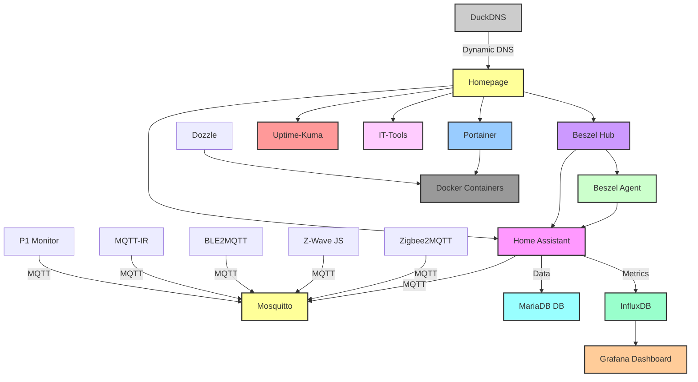

# 🏠 Homelab Dashboard & Automation Stack

## Overzicht
Deze homelab-stack biedt een complete plug-and-play omgeving voor smart home automatisering, monitoring en serverbeheer. Het draait op **Debian 13 Minimal** en gebruikt Docker containers voor maximale isolatie, stabiliteit en eenvoud.  

Alle Docker-installaties gebruiken de **officiële Docker repositories** voor Debian 13, zodat je altijd de nieuwste stabiele versie krijgt.

---

## Functies

### Home Assistant
- Centrale smart home hub.
- Ondersteunt Zigbee, Z-Wave, BLE, RF, IR en P1 Smart Meters.
- Verzamelt data via MQTT en slaat deze op in **MariaDB** voor betere prestaties.
- Dashboard configuratie via YAML-bestanden.

### Beszel
- **Hub**: dashboard met real-time systeemstatus en container monitoring.
- **Agent**: verzamelt metrics van de host machine.
- Lichtgewicht alternatief voor Netdata.
- Eenvoudig te koppelen met Home Assistant en andere services.

### Homepage
- Centrale startpagina voor alle webbased apps in het homelab.
- Statische links en statuswidgets voor:
  - Home Assistant
  - Portainer
  - Beszel
  - Uptime-Kuma
  - IT-Tools
- Basis YAML-bestanden worden automatisch aangemaakt bij eerste opstart.

### Uptime-Kuma
- Monitoren van uptime van services en externe websites.
- Waarschuwingen en meldingen bij downtime.

### Grafana & InfluxDB
- Historische metrics en visualisatie van systeem- en containerstatistieken.
- Grafana dashboards voor CPU, RAM, Disk, Docker containers en meer.

### Portainer
- Docker management interface.
- Containerbeheer, volume-inspectie en netwerkbeheer.

### Dozzle
- Real-time logging van Docker containers.
- Handig voor debugging en monitoring.

### IT-Tools
- Webinterface met diagnostische tools voor netwerk en systeem.
- Toont hardware-informatie, logs en netwerkstatus.

### Mosquitto (MQTT)
- Berichtenbus voor smart home devices en automatisering.
- Communicatie tussen Home Assistant, Zigbee2MQTT, Z-Wave JS, BLE2MQTT en andere IoT-devices.

### MariaDB
- MySQL-database voor Home Assistant.
- Betere prestaties dan standaard SQLite.
- Data migratie eenvoudig via `configuration.yaml`.

### DuckDNS
- Dynamische DNS voor externe toegang.
- Integreert met Home Assistant en andere webbased apps.

---

## Hardware Detectie
- Automatische detectie van USB-devices:
  - Zigbee, Z-Wave, BLE, RF, IR, P1 Smart Meters
- Detectie van Bluetooth-adapters.
- Containers starten alleen als het device aanwezig is.
- Logging van aangesloten hardware en mogelijke fouten.

---

## Netwerk Hardening
- Firewall configuratie via **UFW**:
  - Open poorten voor Home Assistant, Portainer, Beszel, Uptime-Kuma en IT-Tools.
  - Poort 22 open voor SSH.
  - Alle andere inkomende verbindingen standaard geblokkeerd.
- Fail2Ban voor extra SSH-bescherming.
- Root login via SSH uitgeschakeld.

---

## Backup & Data Management
- Automatische dagelijkse backups naar `backups/` directory.
- Backup van configuratiebestanden en kritieke data voor alle containers.
- Restore instructies beschikbaar in documentatie.

---

## Installatie Flow (Functioneel)

```text
                     ┌──────────────┐
                     │ Home         │
                     │ Assistant    │
                     └─────┬────────┘
                           │ MQTT
          ┌────────────────┴───────────────┐
          │                                │
  ┌───────▼────────┐              ┌────────▼────────┐
  │ Zigbee2MQTT    │              │ Z-Wave JS       │
  │ (Zigbee USB)   │              │ (Z-Wave USB)    │
  └────────────────┘              └────────────────┘
          │                                │
          └─────────────┬──────────────────┘
                        │ MQTT
                  ┌─────▼─────┐
                  │ Mosquitto │
                  └─────┬─────┘
                        │
                        │ Data
       ┌────────────────┴───────────────┐
       │                               │
┌──────▼─────┐                   ┌─────▼─────┐
│ MariaDB     │                   │ InfluxDB  │
│ (HA DB)     │                   │ Metrics   │
└──────┬─────┘                   └─────┬─────┘
       │                                 │
       │                                 │
       │                           ┌─────▼─────┐
       │                           │ Grafana   │
       │                           │ Dashboard │
       │                           └───────────┘
       │
       │
       │
 ┌─────▼────────┐
 │ Beszel Hub   │
 │ + Agent      │
 └─────┬────────┘
       │ Stats
       │
 ┌─────▼────────┐
 │ Homepage     │
 │ Dashboard    │
 │ Links/Status │
 └─────┬────────┘
       │
       │ Monitors
 ┌─────▼────────┐
 │ Uptime-Kuma  │
 │ Alerts       │
 └──────────────┘

Additional services:
- **Portainer** → Docker container management  
- **Dozzle** → Real-time container logs  
- **IT-Tools** → Diagnostics & utilities  
- **DuckDNS** → External access / dynamic DNS

---

## Opmerkingen
- Minimum systeemvereisten: 15 GB vrije schijfruimte, 4 GB RAM.
- Hardware zoals Zigbee, Z-Wave of BLE wordt automatisch gedetecteerd.
- Alle logs en foutmeldingen worden weggeschreven naar `$HOME/ha-install.log`.

## Homelab Stack Architectuur (Mermaid)



